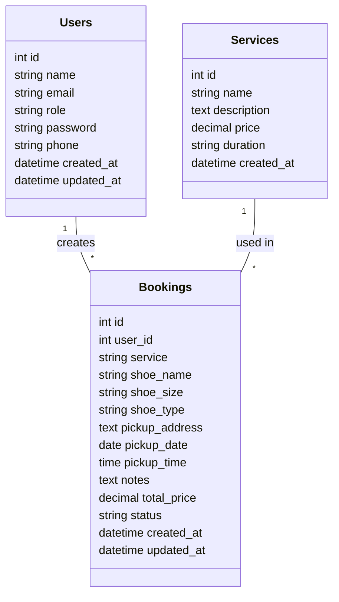
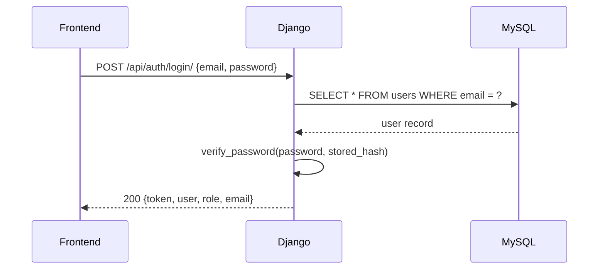
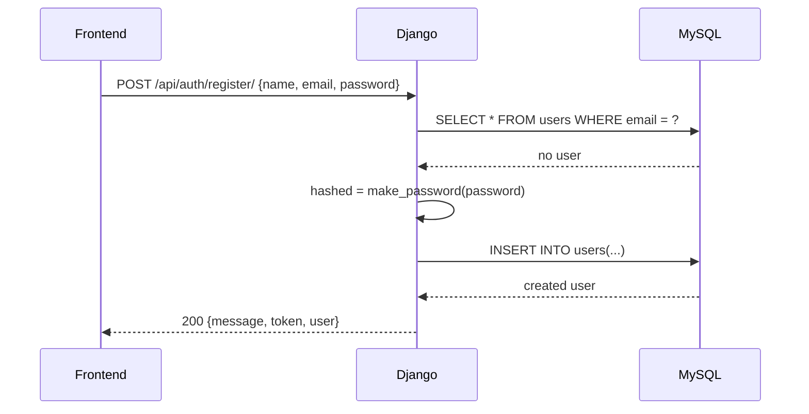

# Laporan Proyek: Newt Shoes

## 1. Pendahuluan

Aplikasi Newt Shoes adalah sistem layanan cuci sepatu berbasis web dengan arsitektur backend Django dan frontend Next.js. Proyek ini menggunakan Docker Compose untuk mengorkestrasi layanan MySQL, backend Django, backend Express, dan frontend.

Tujuan laporan ini adalah menjelaskan analisa kebutuhan, rancangan aplikasi, pemodelan UML, arsitektur, dan fitur utama yang diimplementasikan.

## 2. Analisa Kebutuhan

### 2.1 Kebutuhan Fungsional

1. User dapat mendaftar akun baru.
2. User dapat login menggunakan email dan password.
3. User dapat melihat daftar layanan cuci sepatu.
4. User dapat memesan layanan cuci sepatu.
5. Admin dapat login sebagai admin.
6. Kurir dapat login sebagai courier.
7. Aplikasi menyediakan API dokumentasi interaktif.
8. Backend mendukung throttling dan pagination untuk endpoint tertentu.

### 2.2 Kebutuhan Non-fungsional

1. Sistem dijalankan dalam lingkungan Docker untuk konsistensi pengembangan.
2. Database menggunakan MySQL.
3. Endpoint API harus mengembalikan JSON standar.
4. Autentikasi menggunakan token sederhana.
5. Dokumentasi API interaktif tersedia via Swagger/Redoc.
6. Backend harus dapat menangani permintaan pada role yang berbeda.

### 2.3 Aktor dan Use Case

- Aktor `User`: register, login, melihat layanan, membuat booking.
- Aktor `Admin`: login, mengelola layanan dan booking.
- Aktor `Courier`: login, memantau status booking.

Use case utama:
- Register user
- Login user/admin/courier
- Mendapatkan daftar layanan
- Menggunakan pagination/fitering pada daftar layanan
- Melihat dokumentasi API

## 3. Rancangan Aplikasi

### 3.1 Arsitektur Sistem

Aplikasi menggunakan arsitektur terdistribusi ringan:

- `frontend/`: Next.js + React untuk tampilan pengguna.
- `backend-django/`: Django + Django REST Framework untuk API utama.
- `mysql_db_newt`: MySQL untuk penyimpanan data.
- `docker-compose.yml`: mengorkestrasi semua layanan.

Komunikasi antar layanan:
- Frontend `http://localhost:8080` atau `http://localhost:3000` mengakses API `http://localhost:8000/api`.
- Backend Django mengakses MySQL melalui hostname `db` pada Docker network.

### 3.2 Komponen Utama Backend

#### 3.2.1 Models

Backend Django memiliki tiga model utama:

- `Users`
  - `id`, `name`, `email`, `role`, `password`, `phone`, `created_at`, `updated_at`
  - `role` dapat `user`, `admin`, atau `courier`

- `Services`
  - `id`, `name`, `description`, `price`, `duration`, `created_at`

- `Bookings`
  - `id`, `user_id`, `service`, `shoe_name`, `shoe_size`, `shoe_type`, `pickup_address`, `pickup_date`, `pickup_time`, `notes`, `total_price`, `status`, `created_at`, `updated_at`

#### 3.2.2 Views / Endpoint

Endpoint API utama pada `backend-django/core/urls.py`:

- `GET /api/services/`
- `GET /api/courses/` (pagination, filtering, sorting)
- `POST /api/auth/register/`
- `POST /api/auth/login/`
- `GET /api/hello-throttled/`
- `GET /docs/` dan `GET /redoc/`

#### 3.2.3 Autentikasi dan Keamanan

- Login menggunakan email dan password.
- Password disimpan dengan hashing Django (`make_password`).
- `verify_password()` mengakomodasi hashing Django dan legacy bcrypt.
- Token dihasilkan menggunakan `django.core.signing`.

### 3.3 Frontend

Frontend menggunakan `axios` untuk memanggil API. File penting:
- `frontend/src/lib/api.ts`

Fitur frontend:
- Login / register
- Menyimpan token dan user di cookie/localStorage
- Menggunakan interceptor untuk menambahkan Authorization header pada request

### 3.4 Docker Compose

`docker-compose.yml` berisi layanan:
- `db` (MySQL 8.0)
- `backend` (Express Node.js)
- `frontend` (Next.js)
- `backend-django` (Django API)

Backend Django diatur dengan environment:
- `DB_HOST=db`
- `DB_NAME=newt_shoes`
- `DB_USER=root`
- `DB_PASSWORD=root`

## 4. Pemodelan UML

### 4.1 Class Diagram



### 4.2 Use Case Diagram

```mermaid
usecaseDiagram
    actor User
    actor Admin
    actor Courier

    User --> (Register)
    User --> (Login)
    User --> (View Services)
    User --> (Create Booking)

    Admin --> (Login)
    Admin --> (Manage Services)
    Admin --> (View Booking)

    Courier --> (Login)
    Courier --> (Monitor Delivery)
```

### 4.3 Sequence Diagram: Login



### 4.4 Sequence Diagram: Register



## 5. Desain Database dan Struktur Tabel

### 5.1 Tabel `users`

- `id` : Auto increment primary key
- `name` : Nama pengguna
- `email` : Email unik
- `role` : `user`, `admin`, `courier`
- `password` : Hash password
- `phone` : Nomor telepon
- `created_at`, `updated_at`

### 5.2 Tabel `services`

- `id`
- `name`
- `description`
- `price`
- `duration`
- `created_at`

### 5.3 Tabel `bookings`

- `id`
- `user_id`
- `service`
- `shoe_name`
- `shoe_size`
- `shoe_type`
- `pickup_address`
- `pickup_date`
- `pickup_time`
- `notes`
- `total_price`
- `status`
- `created_at`, `updated_at`

## 6. Implementasi dan Teknologi

### 6.1 Backend Django

Dependensi utama:
- Django 5.2.13
- djangorestframework
- drf-yasg
- bcrypt
- mysqlclient
- django-cors-headers

### 6.2 Frontend Next.js

Dependensi utama:
- next
- react
- axios
- js-cookie
- recharts
- framer-motion

### 6.3 Docker

- `mysql:8.0`
- `python:3.11`
- `node` (untuk frontend dan express backend)

## 7. Testing dan Validasi

### 7.1 Login dan Register

Verifikasi login berhasil untuk:
- `admin@newt.local` / `admin123`
- `kurir@newt.local` / `courier123`
- user uji baru yang dibuat dari endpoint register

### 7.2 Endpoints yang valid

- `POST /api/auth/login/`
- `POST /api/auth/register/`
- `GET /api/services/`
- `GET /api/courses/`
- `GET /docs/`
- `GET /redoc/`

## 8. Kesimpulan dan Rekomendasi

Proyek Newt Shoes sudah memiliki fondasi backend dan frontend yang kuat:
- Authentication role-based untuk user, admin, kurir
- API dokumentasi Swagger
- Backend siap untuk pengembangan fitur booking dan manajemen service

Rekomendasi peningkatan:
1. Tambahkan relasi `ForeignKey` antara `Bookings` dan `Users`.
2. Tambahkan endpoint admin/kurir spesifik.
3. Gunakan JWT untuk autentikasi lebih aman.
4. Tambahkan validasi form lebih lengkap.
5. Buat testing otomatis untuk endpoint API.

---

*Laporan ini dibuat berdasarkan struktur kode dan konfigurasi dalam workspace `simplenewt`.*
